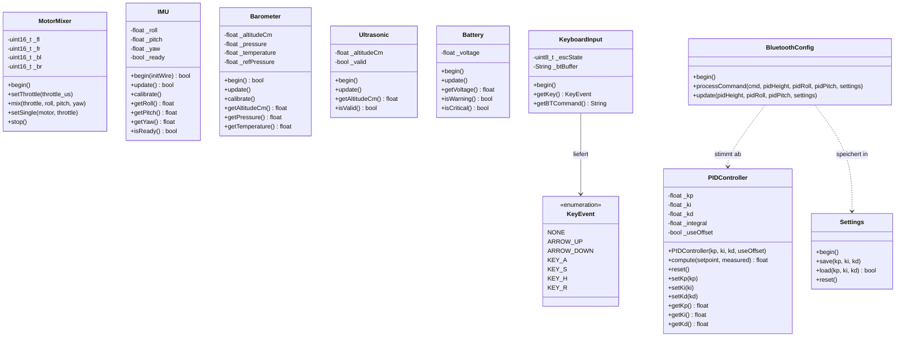

# 🚁 Drohnenprojekt — Raspberry Pi Pico Quadrocopter

**Entwickler:** Willy  
**Stand:** Schritt 8 von 8 — Schwebeflug-Test  
**Ziel Phase 1:** Stabiler Schwebeflug bis 100 cm Höhe

---

## Inhaltsverzeichnis

1. [Hardware](#hardware)
2. [Pinbelegung](#pinbelegung)
3. [Projektstruktur](#projektstruktur)
4. [Klassendiagramm](#klassendiagramm)
5. [Bibliotheken](#bibliotheken)
6. [Konfiguration](#konfiguration)
7. [Test-Modi](#test-modi)
8. [Bluetooth-Befehle](#bluetooth-befehle)
9. [Entwicklungsstand](#entwicklungsstand)
10. [Bekannte Probleme & Lösungen](#bekannte-probleme--lösungen)
11. [Entwicklungsregeln](#entwicklungsregeln)
12. [Sicherheit & Handhabung](#sicherheit--handhabung)

---

## Hardware

| Komponente | Modell | Protokoll |
|---|---|---|
| MCU | Raspberry Pi Pico | — |
| IMU | ICM-20948 9-DoF | I2C (0x69) |
| Barometer | MS5611 | I2C (0x77) |
| Funk | NRF24L01 | SPI (Phase 2) |
| Bluetooth | HC-06 | UART0 |
| Motoren | 4x Brushless + ESC | PWM (nativer RP2040 SDK) |

 (TDK InvenSense ICM-20948 9-DoF IMU STEMMA QT Qwiic-Schnittstelle für STEM-Projekte)
 [ICM-20948 -](https://https://www.adafruit.com/product/4554?srsltid=AfmBOoqJgrg_s14cHHcdieMGC8eEnMb_hd-T7yU6SlsRfc3GowI8pXJ1)

> ⚠️ **ICM-20948 I2C-Adresse:** Laut Datenblatt ergibt AD0 → GND die Adresse 0x68. Auf diesem Board meldet sich der Sensor mit AD0 an GND per I2C-Scan aber tatsächlich unter **0x69**. Adresse im Code (`include/sensor/IMU.h`) daher fest auf 0x69 gesetzt statt vom AD0-Pegel abzuleiten.


### HC-06 Bluetooth Anschluss

| HC-06 Pin | Pico Pin | Hinweis |
|---|---|---|
| VCC | VBUS (5V) | Nicht 3.3V! |
| GND | GND | — |
| TX | PIN 1 (RX) | In der Praxis ohne Pegelwandler getestet |
| RX | PIN 0 (TX) | — |

### Drehrichtungen (X-Konfiguration)

Diagonal gegenüberliegende Motoren drehen gleich (FL/BR gegen den Uhrzeigersinn, FR/BL im Uhrzeigersinn) — das hebt das Reaktionsdrehmoment der Propeller auf, damit die Drohne nicht unkontrolliert um die Hochachse (Yaw) dreht. Am Boden per Motor-Nut-Farbe (schwarz/rot) verifiziert und in Schritt 8 gegen `TEST_MOTORS_SINGLE` geprüft.

```
      Vorne      aktuelle Konfiguation
  FL(CCW) FR(CW)
    ↺        ↻
      \    /
       \  /
       /  \
      /    \
    ↻        ↺
  BL(CW)  BR(CCW)
      Hinten
```
     Vorne
  FL(CW)  FR(CCW)
    ↻        ↺
      \    /
       \  /
       /  \
      /    \
    ↺        ↻
  BL(CCW) BR(CW)
      Hinten

| Motor | Pin | Drehrichtung | Arm-Farbe | Motor-Nut |
|---|---|---|---|---|
| Front Left (FL) | PIN 11 | CCW ↺ | rot | schwarz |
| Front Right (FR) | PIN 12 | CW ↻ | rot | rot |
| Back Left (BL) | PIN 14 | CW ↻ | weiß | rot |
| Back Right (BR) | PIN 13 | CCW ↺ | weiß | schwarz |

Physikalisches Prinzip — Drehmoment:

Jeder rotierende Motor erzeugt ein Gegendrehmoment auf den Rahmen:
FL(CCW) erzeugt → Drehmoment CW auf Rahmen
FR(CW)  erzeugt → Drehmoment CCW auf Rahmen
BL(CW)  erzeugt → Drehmoment CCW auf Rahmen
BR(CCW) erzeugt → Drehmoment CW auf Rahmen

Summe = 0 → Drohne dreht sich nicht! ✅


> Die Motor-Mixing-Formeln in `MotorMixer::mix()` (`FL = throttle - roll + pitch`, `FR = throttle + roll + pitch`, `BL = throttle - roll - pitch`, `BR = throttle + roll - pitch`) hängen nur von der Position ab, nicht von der Propeller-Drehrichtung — die Drehrichtung selbst wird rein mechanisch durch die ESC-Motor-Verkabelung festgelegt.

> ⚠️ **Absolute CW/CCW-Zuordnung ist nicht "die einzig richtige":** Physikalisch zwingend ist nur, dass diagonale Motoren gleich und benachbarte gegensätzlich drehen (Summe Reaktionsdrehmoment = 0). Welche Diagonale konkret CW und welche CCW ist, ist spiegelbildlich beliebig — eine frühere Version dieser Tabelle hatte genau die umgekehrte Zuordnung (FL=CW/FR=CCW/BL=CCW/BR=CW) und wäre ebenso gültig gewesen. Die obige Tabelle gilt speziell für **dieses** Board (eigener Arm-Farbe-Test, Stand 2026-07-05), nicht als Allgemeinregel.
>
> **Sicherheitskritisch ist stattdessen:** Jeder Motor braucht die zu seiner tatsächlichen (gemessenen) Drehrichtung passende Propeller-Steigung (Normal- vs. Pusher-Prop) — sonst schiebt der Propeller Luft nach oben statt unten. Vor der Propeller-Montage: Motor per `TEST_MOTORS_SINGLE` ohne Last einzeln laufen lassen, Drehrichtung von oben beobachten, dann passenden Prop-Typ montieren. Nicht aus abstrakten Konventionen ableiten.

---

## Pinbelegung

Alle Pins zentral in `include/pins.h` — **einzige Wahrheit für alle Pin-Definitionen!**

```cpp
// Motoren (PWM — nativer RP2040 SDK)
PIN_MOTOR_FL  = 11    // Front Left
PIN_MOTOR_FR  = 12    // Front Right
PIN_MOTOR_BR  = 13    // Back Right
PIN_MOTOR_BL  = 14    // Back Left

// I2C (MS5611 Barometer + ICM-20948 IMU, gemeinsamer Bus)
PIN_SDA       = 4
PIN_SCL       = 5
PIN_IMU_INT   = 3     // ICM-20948 Interrupt (optional, noch ungenutzt)

// SPI (NRF24L01) — Phase 2
PIN_NRF_MOSI  = 19
PIN_NRF_MISO  = 16
PIN_NRF_SCK   = 18
PIN_NRF_CSN   = 17
PIN_NRF_CE    = 20
PIN_NRF_INT   = 21

// Bluetooth HC-06 (UART0)
PIN_BT_TX     = 0
PIN_BT_RX     = 1

// ── Ultrasonic HC-SR04 ──────────────────────────
PIN_ULTRASONIC_TRIG1 = 8
PIN_ULTRASONIC_ECHO1 = 6
// PIN_ULTRASONIC_TRIG2 = 9  // für späteren Einsatz eines zweiten Sensors reserviert
// PIN_ULTRASONIC_ECHO2 = 7

// ── Sonstige ────────────────────────────────────
BUZZER        = 10
BATTERY       = 26   // ADC0
```

---

## Projektstruktur

```
drone_pico/
├── platformio.ini          ← PlatformIO Konfiguration
├── README.md               ← Diese Datei
├── include/                ← Alle Header-Dateien (.h)
│   ├── pins.h              ← Hardware-Pinbelegung (einzige Wahrheit!)
│   ├── config.h            ← Parameter, Konstanten, Test-Modi
│   ├── myLogger.h          ← Eigener Logger (keine externe Bibliothek)
│   ├── comm/
│   │   ├── BluetoothConfig.h
│   │   └── KeyboardInput.h
│   ├── control/
│   │   ├── MotorMixer.h
│   │   └── PIDController.h
│   ├── sensor/
│   │   ├── Barometer.h
│   │   └── IMU.h           ← ICM-20948 (Roll/Pitch aktiv, Yaw folgt in Phase 3)
│   └── storage/
│       └── Settings.h
└── src/                    ← Alle Implementierungen (.cpp)
    ├── main.cpp
    ├── myLogger.cpp
    ├── comm/
    │   ├── BluetoothConfig.cpp
    │   └── KeyboardInput.cpp
    ├── control/
    │   ├── MotorMixer.cpp
    │   └── PIDController.cpp
    ├── sensor/
    │   ├── Barometer.cpp
    │   └── IMU.cpp         ← ICM-20948 (Roll/Pitch aktiv, Yaw folgt in Phase 3)
    └── storage/
        └── Settings.cpp
```

> **Konvention:** `.h` in `include/`, `.cpp` in `src/`. PlatformIO findet Header automatisch.

---

## Klassendiagramm



---

## Bibliotheken

Alle Bibliotheken in `platformio.ini`. **Keine neuen Bibliotheken ohne Rücksprache!**

| Bibliothek | Version | Verwendung |
|---|---|---|
| nrf24/RF24 | ^1.4.8 | NRF24L01 Funk (Phase 2) |
| robtillaart/MS5611 | ^0.4.0 | Barometer |
| wollewald/ICM20948_WE | ^1.1.5 | IMU (löst vorherigen MPU9250-Treiber ab) |

**Entfernte Bibliotheken:**

| Bibliothek | Grund |
|---|---|
| ~~mike-matera/FastPID~~ | Eigene PID-Implementierung — keine Koeffizient-Einschränkungen |
| ~~khoih-prog/RP2040_PWM~~ | Nativer RP2040-SDK PWM stabiler und einfacher |
| ~~hideakitai/TaskManager~~ | Zeitsteuerung per `millis()` ausreichend |

---

## Konfiguration

### `platformio.ini`

```ini
[env:rpipico]
platform = https://github.com/maxgerhardt/platform-raspberrypi.git
board_build.core = earlephilhower
board = rpipico
framework = arduino
upload_protocol = picotool
monitor_speed = 115200

lib_deps =
    nrf24/RF24@^1.4.8
    robtillaart/MS5611@^0.4.0
    wollewald/ICM20948_WE@^1.1.5

build_flags =
    -DGLOBAL_DEBUG
;   -DLOG_TIMESTAMP
;   -D_DEBUG_=VERBOSE
;   -D_DEBUG_=NOTICE
;   -D_DEBUG_=WARNING
;   -D_DEBUG_=FATAL
```

### ESC PWM Parameter

| Parameter | Wert |
|---|---|
| Frequenz | 50 Hz |
| Minimum (Stop) | 1000 µs |
| Maximum (Vollgas) | 2000 µs |
| Basis-Offset (Anlauf) | 1100 µs |
| Throttle-Schritt | 50 µs |

### Barometer Konfiguration

| Parameter | Wert |
|---|---|
| Oversampling | OSR_ULTRA_HIGH |
| Filter | Gleitender Mittelwert, 20 Samples |
| Aufwärmzeit | 90 Sekunden |
| Kalibrierung | 20 Messungen à 100ms |
| Genauigkeit (Stillstand) | ± 1 cm |
| I2C Adresse MS5611 | 0x77 |
| I2C Adresse ICM-20948 | 0x69 (AD0=GND, siehe Hinweis in [Hardware](#hardware)) |

> ℹ️ Der MS5611 ist sehr empfindlich — Handbewegungen in der Nähe beeinflussen die Messung. Im Freien deutlich stabiler als im Innenraum.

### PID-Regler

Eigene Implementierung ohne externe Bibliothek.

| Parameter | Standardwert | Einstellbar per |
|---|---|---|
| Kp | 2.0 | Bluetooth |
| Ki | 0.03 | Bluetooth |
| Kd | 0.3 | Bluetooth |
| Regelfrequenz | 20 Hz (50ms) | config.h |
| Anti-Windup | ±500 | PIDController.h |
| Basis-Throttle | 1100 µs | config.h |

PID-Werte werden im Flash gespeichert und beim Start automatisch geladen.

### EEPROM-Layout

| Adresse | Inhalt | Größe |
|---|---|---|
| 0x00 | Kp | 4 Byte (float) |
| 0x04 | Ki | 4 Byte (float) |
| 0x08 | Kd | 4 Byte (float) |
| 0x0C | Validierungs-Marker (0xAB) | 1 Byte |

---

## Test-Modi

Test-Modi in `include/config.h` per `#define` aktivieren.
**Immer nur einen Test-Modus gleichzeitig!**

```cpp
// #define TEST_MOTORS         // Schritt 2: ESC/Motor Test (alle vier)
// #define TEST_MOTORS_SINGLE  // Einzelmotor-Test per Index
// #define TEST_BAROMETER      // Schritt 3: MS5611 Test
// #define TEST_KEYBOARD       // Schritt 4: Tastatur Test
// #define TEST_I2C_SCAN       // Diagnose: I2C Bus Scanner
// #define TEST_IMU            // ICM-20948 Roll/Pitch/Yaw Dauerausgabe
// #define TEST_ULTRASONIC     // HC-SR04 Distanzmessung
// Alle auskommentiert = NORMALBETRIEB
```

### TEST_MOTORS
Motortest per Serial-Befehl. **Propeller abnehmen!**
- `+` → Throttle +50 µs
- `-` → Throttle -50 µs
- `s` → STOP

### TEST_MOTORS_SINGLE
Wie `TEST_MOTORS`, aber steuert nur einen einzelnen Motor per Index an. **Propeller abnehmen!**

### TEST_BAROMETER
Barometer-Ausgabe alle 500ms: Höhe, Druck, Temperatur.

### TEST_KEYBOARD
Pfeiltasten-Erkennung + Barometer-Ausgabe.
- Pfeil hoch → Zielhöhe +10 cm
- Pfeil runter → Zielhöhe -10 cm
- `a` → ARM
- `r` → Barometer rekalibrieren
- `s` → DISARM
- `h` → Hilfe

> ⚠️ **Pfeiltasten:** Im PlatformIO Terminal (`pio device monitor`) — nicht im eingebauten Serial Monitor!

### TEST_I2C_SCAN
Scannt den I2C-Bus:
- `0x69` → ICM-20948 ✅ (AD0=GND, siehe Hinweis in [Hardware](#hardware))
- `0x77` → MS5611 ✅

### TEST_IMU
Kontinuierliche Ausgabe von Roll/Pitch/Yaw sowie Rohwerten des ICM-20948.

### TEST_ULTRASONIC
Distanzmessung beider HC-SR04-Kanäle im Wechsel.

### NORMALBETRIEB (alle auskommentiert)
Vollständiger Regelkreis mit PID-Höhenregelung.

**Befehle:**
- Pfeil hoch → Zielhöhe +10 cm
- Pfeil runter → Zielhöhe -10 cm
- `a` → ARM (Rekalibrierung + Motoren ein, Ziel 20 cm)
- `s` → DISARM (Motoren sofort stopp)
- `r` → Barometer rekalibrieren + PID reset
- `h` → Hilfe

---

## Bluetooth-Befehle

Verbindung per PuTTY. **Baudrate: 9600**

| Befehl | Funktion | Beispiel |
|---|---|---|
| `?` | Aktuelle PID-Werte anzeigen | `?` |
| `P=x.x` | Kp setzen | `P=2.0` |
| `I=x.x` | Ki setzen | `I=0.03` |
| `D=x.x` | Kd setzen | `D=0.3` |
| `S` | Werte im Flash speichern | `S` |
| `R` | EEPROM zurücksetzen | `R` |

**PuTTY Einstellungen:**
- Connection type: Serial
- Speed: 9600
- Terminal → Local echo: Force on
- Terminal → Local line editing: Force on

---

## Entwicklungsstand

| Schritt | Inhalt | Status |
|---|---|---|
| 1 | Projektstruktur | ✅ Fertig |
| 2 | PWM & Motortest | ✅ Fertig |
| 3 | Barometer MS5611 | ✅ Fertig |
| 4 | Tastatur-Eingabe | ✅ Fertig |
| 5 | PID-Regler (eigene Impl.) | ✅ Fertig |
| 6 | Bluetooth PID-Config | ✅ Fertig |
| 7 | Flash-Speicher (EEPROM) | ✅ Fertig |
| 8 | Schwebeflug-Test | 🔄 Aktuell |

**Geplante Folgephasen:**

| Phase | Inhalt |
|---|---|
| 2 | Manuelle Steuerung per NRF24 Fernbedienung |
| 3 | Yaw-Stabilisierung (Gyro-Integration + Magnetometer, ICM-20948) |
| 4 | GPS-gestütztes Positions-Halten |
| 5 | Autonome Flugrouten |

> Roll/Pitch-Lage-Stabilisierung per ICM-20948 läuft bereits im Normalbetrieb (kaskadierte Höhen- + Lage-PID). Phase 3 fehlt nur noch Yaw.

---

## Bekannte Probleme & Lösungen

### PWM — RP2040_PWM Bibliothek
**Problem:** Kompiliert nicht zuverlässig unter PlatformIO.
**Lösung:** Nativer RP2040-SDK PWM direkt verwendet. Bibliothek entfernt.

### MS5611 nicht gefunden
**Problem:** `[BARO] ERROR: MS5611 nicht gefunden!`
**Lösungen:**
1. PS-Pin und NCS-Pin → an 3.3V anschließen
2. SDA/SCL vertauscht → Verkabelung prüfen
3. I2C-Scanner starten: `TEST_I2C_SCAN`

### Barometer-Drift im Innenraum
**Problem:** Höhenwerte driften nach dem Start stark (bis ±100 cm).
**Ursache:** MS5611 extrem empfindlich — Selbsterwärmung, Luftzug, Handbewegungen in der Nähe.
**Lösung:**
- 90s Aufwärmzeit vor Kalibrierung
- Rekalibrierung (`r`) direkt vor dem Armen
- Für präzise Tests: im Freien testen

### ICM-20948 nicht gefunden / falsche I2C-Adresse
**Problem:** `[IMU] ERROR: ICM-20948 nicht gefunden!`, obwohl AD0 an GND liegt.
**Ursache:** Auf diesem Board meldet sich der Sensor mit AD0=GND nicht unter der laut Datenblatt erwarteten 0x68, sondern unter 0x69.
**Lösung:** `TEST_I2C_SCAN` ausführen und die tatsächlich gefundene Adresse prüfen. Adresse ist in `include/sensor/IMU.h` fest auf 0x69 gesetzt.

### FastPID — Ungültige Koeffizienten
**Problem:** FastPID meldet Fehler bei normalen PID-Werten wegen interner Koeffizient-Grenzen.
**Lösung:** Eigene PID-Implementierung. FastPID entfernt.

### Pfeiltasten werden nicht erkannt
**Problem:** Eingebauter Serial Monitor überträgt keine ANSI Escape-Sequenzen.
**Lösung:** `pio device monitor` im VSCode Terminal verwenden.

### Pico wird von Windows nicht erkannt
**Problem:** Kein USB-Piepsen, kein COM-Port nach dem Flashen.
**Lösung:** `flash_nuke.uf2` auf den Pico laden (BOOTSEL-Modus), dann neu flashen.
Download: https://datasheets.raspberrypi.com/soft/flash_nuke.uf2

### HC-06 — PuTTY Verbindung schlägt fehl
**Problem:** "Zeitlimit für die Semaphore wurde erreicht"
**Lösung:** Erst HC-06 in Windows Bluetooth aktiv verbinden (LED leuchtet dauerhaft), dann PuTTY öffnen.

---

## Entwicklungsregeln

- Schritt für Schritt — kein nächster Schritt bevor der aktuelle funktioniert
- Keine neuen Bibliotheken ohne Rücksprache
- Fehler zuerst beheben, dann weitermachen
- `pins.h` ist die einzige Wahrheit für alle Pin-Definitionen
- `.h` in `include/`, `.cpp` in `src/`
- Test-Modi nie im Produktivbetrieb aktiv lassen
- PID-Werte nach Änderung immer mit `S` speichern

---

## Sicherheit & Handhabung

### ESD-Schutz & Komponentenhandhabung

Besonders gefährdete Bauteile:

| Komponente | Empfindlichkeit |
|---|---|
| RP2040 (Pico) | Sehr hoch — CMOS-Prozessor |
| ICM-20948 / IMU | Hoch — MEMS-Struktur |
| MS5611 | Hoch — Drucksensor-Membran |
| MOSFETs in ESCs | Mittel-hoch |

Maßnahmen (Priorität):
1. **Antistatik-Armband** beim Arbeiten tragen
2. Antistatik-Arbeitsmatte (~10–15 €) empfohlen
3. Ersatz-Platinen in **antistatischen Tüten** lagern
4. Vor dem Anfassen: kurz geerdetes Metallteil berühren (Heizung, PC-Gehäuse)
5. **USB-Kabel ziehen**, bevor am Board gearbeitet wird
6. Lötreihenfolge: zuerst GND, zuletzt VCC
7. I2C-Kabel **niemals** im laufenden Betrieb stecken → Chip-Schaden möglich

> **Erfahrung aus diesem Projekt:** Drei IMU-Boards (MPU9250) wurden durch ESD zerstört, bevor auf ICM-20948 mit konsequentem ESD-Schutz umgestellt wurde.

### Ein-/Ausschalten — Reihenfolge & Hinweise

**Einschalten:**
1. Drohne **ruhig hinlegen** — IMU kalibriert Gyro-Offsets beim Start
2. **Akku anschließen** → ESCs piepen (Initialisierung abwarten)
3. **~30–90 s warten** — Barometer-Aufwärmzeit; erst danach `a` (ARM)
4. USB optional danach für Serial-Monitor

**Ausschalten:**
1. **`s` drücken** (DISARM) — Motoren auf Minimum
2. Erst danach Akku trennen
3. Nie unter Last trennen — Lichtbogen schadet Kontakten und ESCs

**ESD beim Stecken:**
- Stecker immer am Gehäuse anfassen, nie an Pins
- XT60-Stecker zügig verbinden (langsames Stecken → Lichtbogen)
- **Anti-Spark-Widerstand** am XT60 empfehlenswert (~2 €)
- I2C-Kabel (IMU, MS5611) niemals im laufenden Betrieb stecken

---

## Test- und Prüfergebnisse

Motor-Drehrichtung + Arm-Farbe/Motor-Nut siehe [Drehrichtungen (X-Konfiguration)](#drehrichtungen-x-konfiguration).

| Modul | Board | I2C-Adresse |
|---|---|---|
| MS5611 | GY-63 | 0x77 |
| ICM-20948 | Breakout (AD0 → GND) | 0x69 (siehe Hinweis oben) |

HC-06 Bluetooth Pairing-PIN: `1234`


## Änderungen für den Einsatz den PICO 2W

3. Windows Long Path aktivieren — wichtig für den Earle Philhower Core!
Im Terminal als Administrator:
reg add HKLM\SYSTEM\CurrentControlSet\Control\FileSystem /v LongPathsEnabled /t REG_DWORD /d 1 /f

## Links
Pico: https://datacapturecontrol.com/articles/io-devices/microcontrollers/rpi-pico
